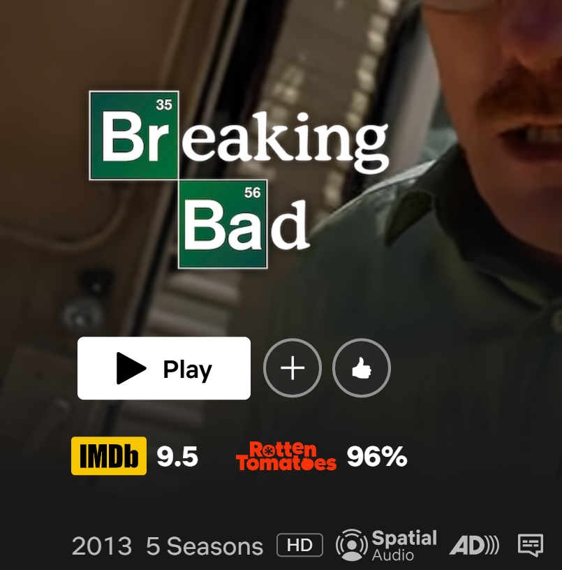
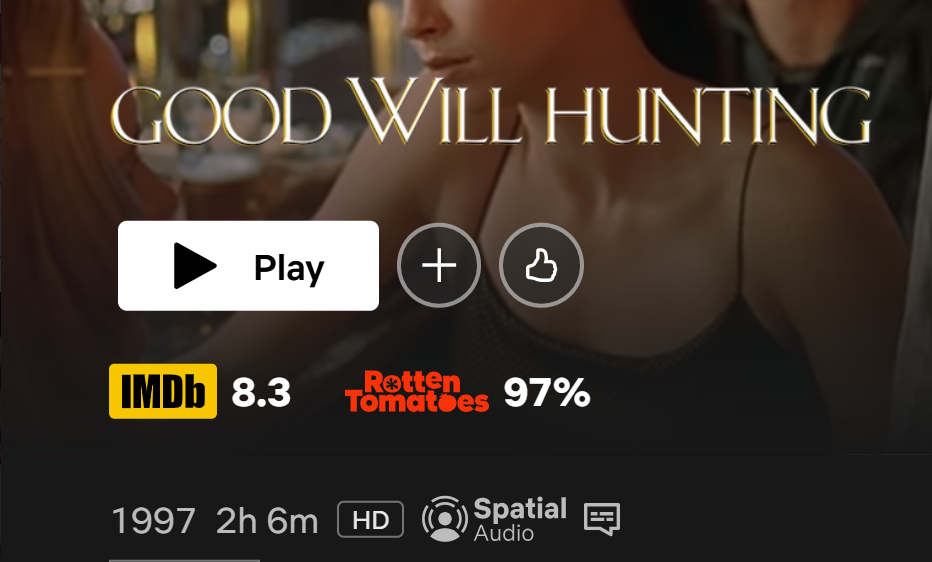
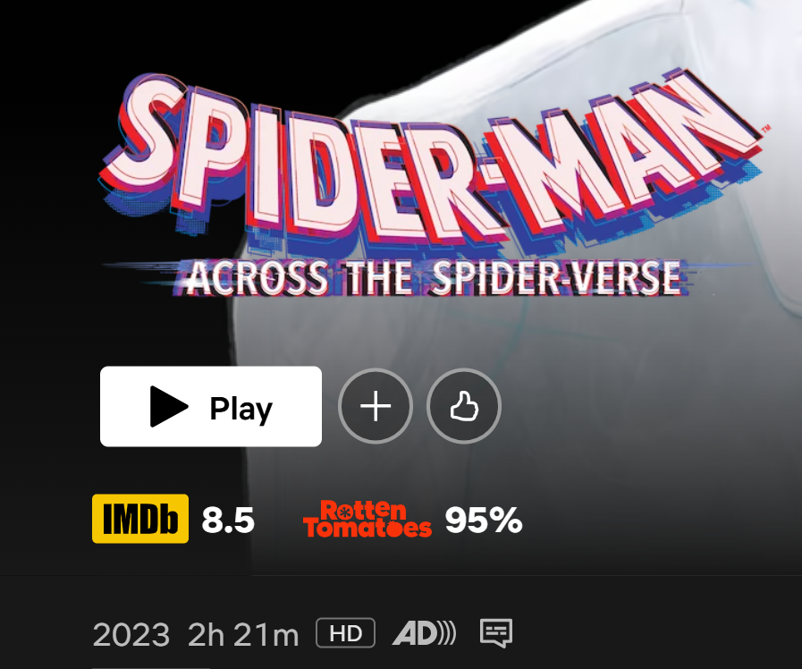

# 🧩 What's the rating

## 🔎 Overview
An extension to display IMDB rating, rotten tomatoes score and metacritic score of selected title in the Netflix web application.\
Facilitated by the [OMDb API](https://www.omdbapi.com/).

## ⚒️ Tech Stack
- Vanilla javascript to edit netflix.com DOM, extract title details and insert the div to display ratings.
- NodeJS backend with express sever to make requests to the OMDb API.

## ⚙️ Installation & Setup

### Prerequisites - Ensure [Node.js](https://nodejs.org/) is installed on the system.

### Steps
1. Navigate to your preferred folder and clone the repository
    ```shell
    git clone https://github.com/zarwaan/whats-the-rating.git
    cd whats-the-rating
    ```
2. Install dependencies inside the server directory
    ```shell
    cd server
    npm install
    ```
3. Procure an [OMDb API key](https://www.omdbapi.com/apikey.aspx)
4. Create a `.env.development` file inside the server directory and fill the environment variables
    ```shell
    OMDB_API_KEY = # your omdb api key
    PORT = "3000" # can be changed to your liking
    ```
5. Navigate to chrome extensions page (chrome://extensions/)
6. Enable developer mode and click on "load unpacked"
7. Select the `extension` directory inside whats-the-rating from where its stored on your device
8. Start the server
    ```shell
    npm run dev
    ```
9. Navigate to [netflix.com](https://netflix.com) on Chrome and select any title to view its IMDb and Rotten Tomatoes ratings.

## 📸 Screenshots






## Created and maintained by Zarwaan Shroff